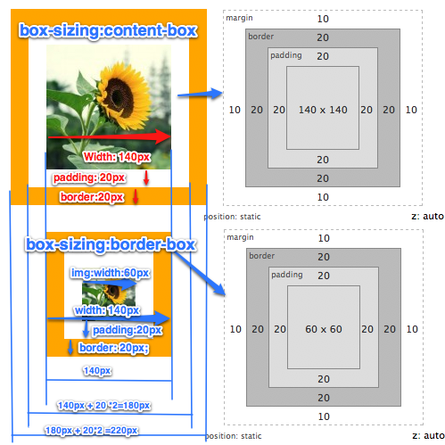

# notes
笔记记录
<h1><a href="marquee.html">marquee 广告轮播</a></h1>
<h3>语法：&lt;marquee&gt;&lt;/marquee &gt;</h3>

<h3>属性：</h3>
<h4>behavior 设定滚动方式：</h4>
<h5>alternate:来回滚动；scorll重复滚动；slide:不重复滚动</h5>
<h4>direction 设定活动字幕的滚动方向</h4>
<h5>down、 left、 right 、 up</h5>
<h4>width、height</h4>
<h4>loop 设定滚动次数：</h4>
<h5>loop="-1" 无限【默认】；</h5>
<h4>scrollamount设定活动字幕的滚动速度，单位pixels</h4>
<h4>scrolldelay设定活动字幕滚动两次之间的延迟时间，单位millisecond（毫秒）</h4>

<h1>CSS3 属性</h1>

<h2>box-sizing：</h2>
<h3>语法：box-sizing ： content-box || border-box || inherit</h3>
<h4>块元素浏览器默认计算方式是：左右border+左右padding+左右margin+内容宽度width</h4>
<h4>box-sizing的取值为：content-box/padding-box/border-box</h4>
<h5>(1)content-box(w3c标准):这种计算方式要求将浏览器width属性应用到内容上，所以计算方式与浏览器一样 ，没必要设置</h5>
<h5>padding-box:这种计算方式中width属性=内容宽度+padding宽度*2 </h5>
<h5>border-box（传统IE浏览器）:将width属性应用到border区域（包含border大小），width=内容宽度+border宽度+padding宽度，border变化只影响内容宽度</h5>
<h3>如图：</h3>
